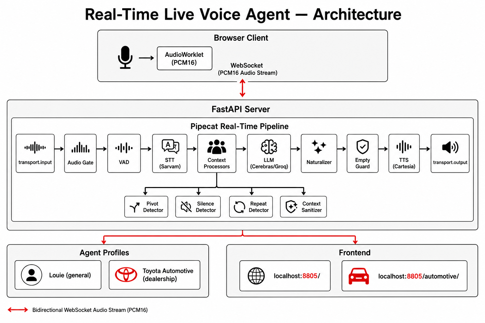
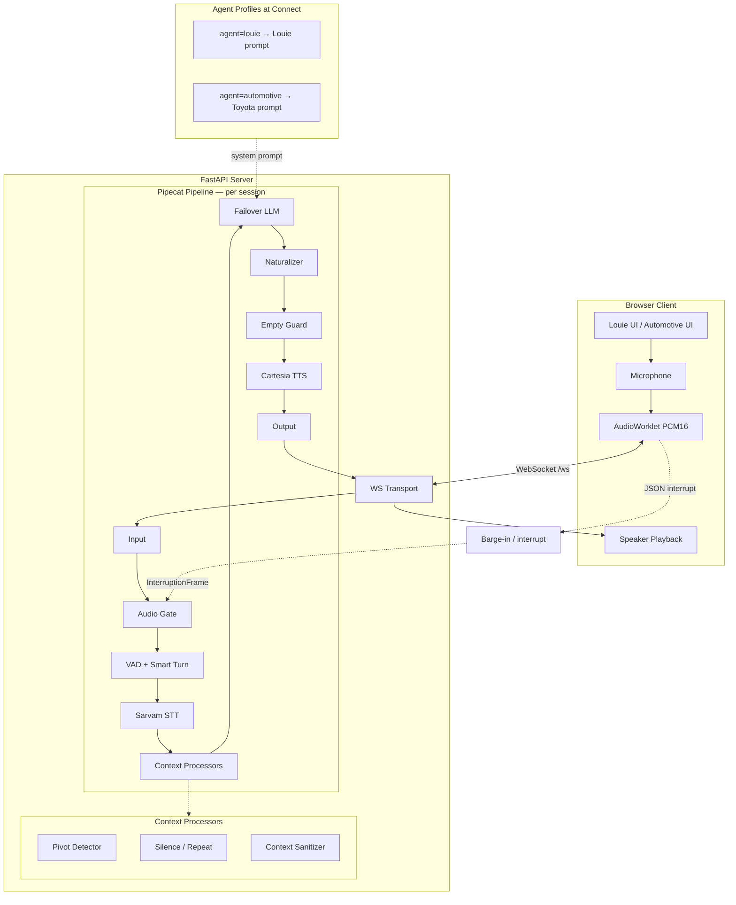
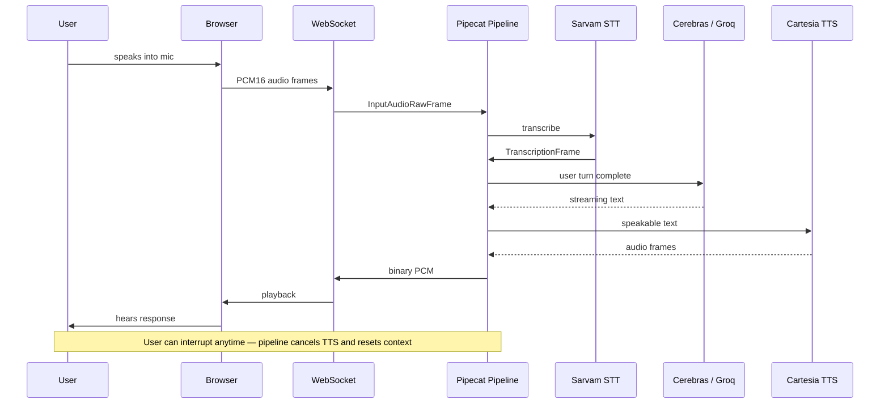

# Real-Time Live Voice Agent

A production-oriented, **real-time voice AI platform** built for natural spoken conversations — not chatbot-style request/response. The system streams microphone audio over WebSocket, runs a multi-stage Pipecat pipeline (STT → LLM → TTS), and supports **barge-in**, **smart turn detection**, and **pluggable agent personas** on a shared voice core.

**Live demos in this repo:**

| Demo | URL | Agent |
|------|-----|-------|
| General voice assistant (**Louie**) | `http://localhost:8805/` | Friendly general-purpose voice agent |
| Toyota dealership showroom | `http://localhost:8805/automotive/` | Domain-specific customer-service advisor |

---

## Why this project matters

Most “voice bots” feel robotic because they treat speech as text chat with TTS pasted on top. This project treats voice as a **streaming conversation**:

- Sub-second turn-taking with Silero VAD + smart turn analysis
- Real barge-in (user can interrupt mid-sentence; bot stops immediately)
- Echo suppression while the bot speaks, with loud-speech passthrough for intentional interrupts
- Voice-first LLM output normalization (no markdown, lists, or robotic filler)
- Graceful degradation when the LLM returns empty or rate-limited responses
- **Separate system prompts per use case** without forking the pipeline — same engine, different persona

This is the kind of architecture used in dealership IVR replacement, hands-free mobile browsing, and multilingual customer service — implemented with open, swappable components rather than a black-box voice API.

---

## Tech stack

| Layer | Technology |
|-------|------------|
| **Realtime orchestration** | [Pipecat](https://github.com/pipecat-ai/pipecat) 1.5 |
| **Backend** | FastAPI, Uvicorn, WebSocket |
| **Speech-to-text** | Sarvam AI (`saaras:v3`, auto language detect) |
| **LLM** | Cerebras `gpt-oss-120b` with automatic Groq failover |
| **Text-to-speech** | Cartesia Sonic 3.5 (~40 ms TTFB) |
| **Turn detection** | Silero VAD + LocalSmartTurnAnalyzerV3 |
| **Client** | Vanilla JS, AudioWorklet, raw PCM16 streaming |
| **Dependency management** | [uv](https://docs.astral.sh/uv/) + Python 3.12 |

---

## Architecture



*High-level view: browser streams PCM audio over WebSocket into a multi-stage Pipecat pipeline; agent persona (Louie vs Toyota) is selected at connect time without changing the voice core.*

<details>
<summary>Interactive diagram (Mermaid — renders on GitHub)</summary>



</details>

### Data flow (one turn)



### Pipeline stages (server)

Each WebSocket session spins up an independent Pipecat pipeline:

```
transport.input()
  → client_interrupt      # browser-side barge-in signal
  → audio_gate            # echo rejection while bot speaks
  → vad                   # Silero VAD + turn start
  → turn_reset            # drop truncated replies on interrupt
  → silence_detector      # re-engage user after silence gaps
  → stt                   # Sarvam STT
  → call_mute             # hold/resume when user is on a phone call
  → repeat_detector       # "say that again" intent
  → user_aggregator       # smart turn stop + context build
  → context_sanitizer     # trim + dedupe messages before LLM
  → pivot_detector        # mid-conversation topic change
  → llm                   # FailoverLLMService (Cerebras → Groq)
  → naturalizer           # voice-first text cleanup
  → llm_empty_guard       # timeout + empty-response fallbacks
  → tts                   # Cartesia TTS
  → rtvi                  # UI state events to browser
  → assistant_aggregator
  → transport.output()
```

### Agent profiles (pluggable personas)

The voice pipeline is shared. Persona and domain knowledge are injected via **agent profile**:

- **`agent=louie`** (default) — general assistant; system prompt in `server/pipeline.py`
- **`agent=automotive`** — Toyota dealership customer-service advisor; system prompt in `server/agents/automotive/prompts.py`

The automotive prompt inherits all Louie voice mechanics (interruption handling, silence tiers, repeat requests, background speech filter, voice-first rules) and adds Toyota domain behavior (specs, service booking, finance, test drives, parts, warranty, dealer lookup).

Selection happens at connect time:

```
ws://localhost:8805/ws?agent=louie&lang=en-IN
ws://localhost:8805/ws?agent=automotive&lang=hi-IN
```

---

## Key engineering highlights

- **Failover LLM** — transparent retry on Cerebras HTTP 429 (`queue_exceeded`) to Groq, same model family, no duplicated speech
- **Pivot detector** — regex + semantic similarity catches mid-flow topic switches ("actually, show me the Verna instead") and re-steers the LLM
- **Response naturalizer** — strips markdown, URLs, robotic preambles; preserves streaming whitespace for natural TTS
- **LLM empty guard** — separate timeout vs empty-response fallback pools; suppresses speech on `[BACKGROUND]` room chatter
- **Audio gate** — blocks mic echo during bot playback; allows loud barge-in based on RMS threshold
- **Client-side barge-in** — AudioWorklet VAD + debounce + server VAD; sends `{type: "interrupt"}` over WebSocket
- **Dual frontend** — minimal Louie demo + full Toyota dealership UI (carousel, model grid, live transcript, sticky CTAs) sharing one `VoiceAgent` class

---

## Project structure

```
real-time-live-agent/
├── client/
│   ├── index.html              # Louie demo UI
│   ├── agent.js                # Shared WebSocket + mic + playback + barge-in
│   ├── audio-processor.js      # AudioWorklet (PCM streaming + local VAD)
│   └── automotive/             # Toyota dealership frontend
│       ├── index.html
│       ├── automotive.js
│       └── styles.css
├── images/                     # Car assets served at /images/
├── docs/
│   └── architecture.png        # System architecture diagram (README)
├── server/
│   ├── main.py                 # FastAPI app, /ws, static file serving
│   ├── pipeline.py             # Pipeline assembly + Louie system prompt
│   ├── config.py               # Env vars, model constants
│   ├── agents/automotive/
│   │   └── prompts.py          # Toyota system prompt (separate from Louie)
│   ├── services/
│   │   └── failover_llm.py     # Cerebras-primary LLM with Groq fallback
│   ├── processors/             # Custom Pipecat frame processors
│   └── serializers/
│       └── raw_pcm.py          # Raw PCM + JSON control messages
├── voice-agent/
│   ├── pyproject.toml          # Python dependencies (uv)
│   └── uv.lock
├── automotive_rag_agent_plan.md  # Roadmap: RAG, tools, LangGraph workflows
└── README.md
```

---

## Prerequisites

- **Python 3.12** (see `voice-agent/pyproject.toml`)
- **[uv](https://docs.astral.sh/uv/)** (recommended) or an existing venv with dependencies installed
- **API keys** for cloud AI services (see below)
- Modern browser with microphone access (Chrome / Edge recommended)

---

## Setup

### 1. Clone and install dependencies

```powershell
cd real-time-live-agent
uv sync --project voice-agent
```

If `uv sync` fails on Windows due to native builds (e.g. `webrtcvad`), use the existing venv:

```powershell
voice-agent\.venv\Scripts\python.exe -m pip install -e voice-agent
```

### 2. Configure environment

Create `.env` at the project root (`real-time-live-agent/.env`):

```env
CEREBRAS_API_KEY=your_cerebras_key
SARVAM_API_KEY=your_sarvam_key
CARTESIA_API_KEY=your_cartesia_key
GROQ_API_KEY=your_groq_key          # optional but recommended for LLM failover
HOST=0.0.0.0
PORT=8805
```

> Never commit `.env` to version control.

### 3. Run the server

From the `server/` directory, using the project venv:

```powershell
cd server
..\voice-agent\.venv\Scripts\python.exe -m uvicorn main:app --host 0.0.0.0 --port 8805
```

The server serves both the API and the frontend — **no separate client server needed**.

### 4. Open in browser

| Demo | URL |
|------|-----|
| Louie | http://localhost:8805/ |
| Toyota showroom | http://localhost:8805/automotive/ |

Click **Connect** / **Start Voice Session**, allow microphone access, and speak naturally.

---

## API endpoints

| Method | Path | Description |
|--------|------|-------------|
| `GET` | `/health` | Liveness check |
| `GET` | `/ready` | Validates required API keys are configured |
| `WS` | `/ws?agent=louie\|automotive&lang=en-IN\|hi-IN` | Real-time voice session |
| `GET` | `/images/*` | Static car images for automotive UI |
| `GET` | `/`, `/automotive/` | Frontend static files |

---

## Verification checklist

1. Server logs `Uvicorn running on http://0.0.0.0:8805`
2. `GET /health` returns `{"status":"ok"}`
3. Browser connects; status shows **Listening**
4. Speak for 2–3 seconds; bot responds with streamed audio
5. Interrupt mid-sentence — bot stops and listens
6. `/automotive/` uses Toyota advisor tone; `/` uses Louie

---

## Roadmap

Documented in [`automotive_rag_agent_plan.md`](automotive_rag_agent_plan.md):

- [ ] RAG layer (Qdrant + document ingest) for brochure/spec Q&A
- [ ] Tool calling (service booking, EMI calculator, inventory lookup)
- [ ] LangGraph workflows behind tools for multi-turn transactional flows
- [ ] Admin document upload API

The voice pipeline and agent-profile pattern are designed so RAG and tools plug in **without changing** the realtime audio path.

---

## Skills demonstrated

- Real-time systems (WebSocket streaming, AudioWorklet, low-latency TTS)
- Voice UX engineering (barge-in, turn detection, echo gating, natural speech output)
- LLM integration (streaming, failover, reasoning-token tuning, empty-response handling)
- Modular backend design (custom Pipecat processors, pluggable agent personas)
- Full-stack delivery (FastAPI backend + production-style dealership frontend)
- Multilingual voice (English, Hindi, Hinglish via Sarvam auto-detect)

---

## License

Private / portfolio project. API usage subject to respective provider terms (Cerebras, Sarvam, Cartesia, Groq).
