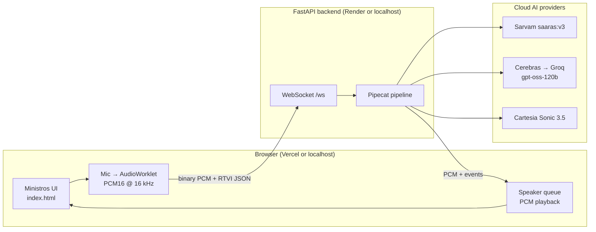
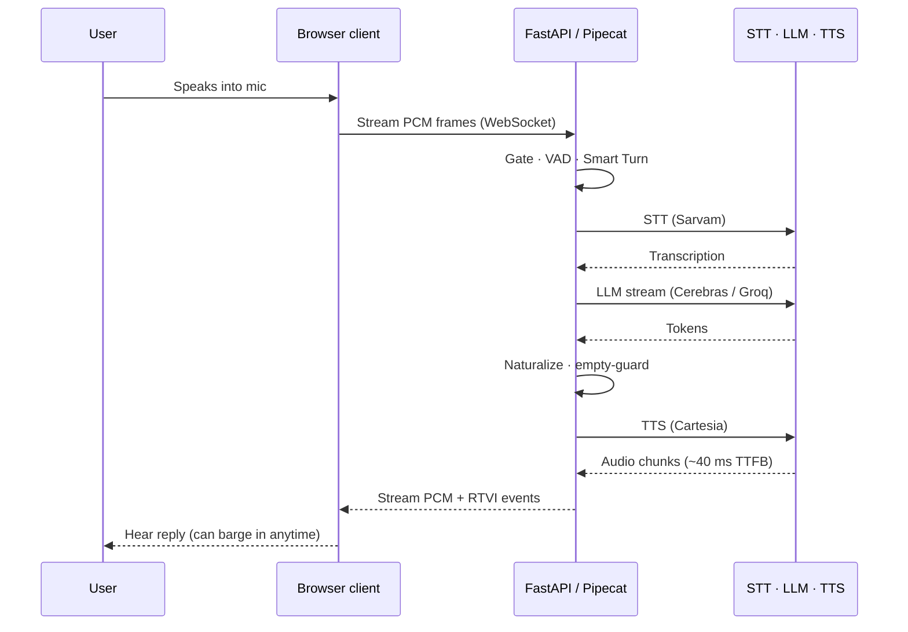
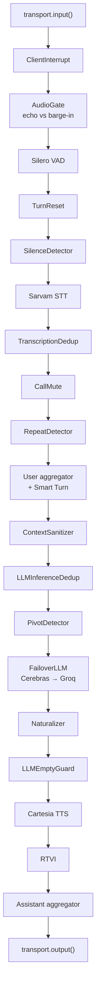
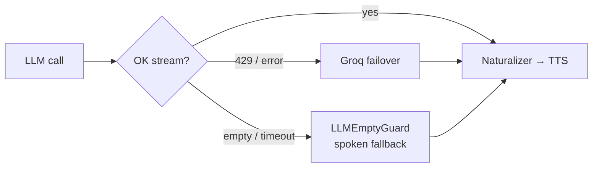

# Lumina

Class 10 Mathematics AI tutor with a live voice session. The student studies a lesson in the browser and talks to the tutor over a WebSocket.

**Product UI:** `tutor-frontend/` (Next.js → **Vercel**)  
**Voice engine:** `server/` (FastAPI + Pipecat → **Render**)

**Production deploy:** [docs/deployment.md](docs/deployment.md) — Vercel frontend, Render backend, env vars, WebSocket, CORS, deployment order.

Engineer overview: [docs/ARCHITECTURE.md](docs/ARCHITECTURE.md)

The engine can still stream a conversation like a phone call (barge-in, Smart Turn, spoken replies). The tutor layer on top of it keeps the session inside Class 10 maths.

<p align="center">
  <a href="voice_agent_working.mp4">
    
  </a>
  &nbsp;
  
  
  
</p>

<p align="center">
  <sub>
    <strong>Speak naturally · Interrupt mid-sentence · Hear replies stream in real time</strong><br/>
    Sarvam STT · Cerebras / Groq LLM · Cartesia Sonic TTS · Silero VAD · Smart Turn
  </sub>
</p>

<p align="center">
  <video src="voice_agent_working.mp4" controls width="720" style="max-width:100%; border-radius:12px; box-shadow:0 8px 32px rgba(0,0,0,0.25);">
    <a href="voice_agent_working.mp4"><strong>▶ Watch the working demo</strong></a>
  </video>
</p>

---

## Why Ministros exists

Most “voice bots” are text chatbots with TTS bolted on. They wait for you to finish, batch a full reply, then read a paragraph. The result feels robotic: long pauses, no interruptions, markdown-y answers spoken aloud.

**Ministros is built as a streaming conversation engine.**

- Microphone audio flows continuously over a WebSocket
- A multi-stage Pipecat pipeline turns speech → intent → spoken reply in near real time
- You can **barge in** while the bot is talking; playback stops immediately
- Replies are written for **ears**, not screens — short, natural, no bullet lists

That is the difference between a demo widget and something you would actually talk to.

---

## Features

| Capability | What you get |
|---|---|
| **Streaming duplex voice** | Raw PCM16 @ 16 kHz over WebSocket — mic up, speaker down, same session |
| **True barge-in** | Server VAD + client AudioWorklet; bot audio flushes the moment you speak over it |
| **Smart turn-taking** | Silero VAD starts turns; LocalSmartTurnAnalyzerV3 decides when you’ve finished |
| **Echo-aware audio gate** | Drops speaker echo while Ministros talks; still lets loud intentional interrupts through |
| **Voice-first LLM style** | System prompt + naturalizer strip markdown, disclaimers, and robotic openers |
| **LLM failover** | Cerebras primary → automatic Groq retry on rate limits / errors (`gpt-oss-120b`) |
| **Empty / timeout guards** | If the model returns nothing useful, a natural spoken fallback is injected |
| **Deduped turns** | Transcription + LLM-inference dedup prevent double replies from racing turn detectors |
| **Wake-word awareness** | “Hey Ministros” / name-only greetings handled as presence, not a full re-intro |
| **Call-mute phrases** | “One sec, got a call” pauses the pipeline; “I’m back” resumes |
| **Repeat detection** | “Say that again” reuses context instead of inventing a new answer |
| **Topic pivot detection** | Soft awareness when the user changes subject mid-conversation |
| **Context hygiene** | Truncated barge-in replies cleaned; history trimmed for stable latency |
| **Deploy-ready split** | Static UI on Vercel · FastAPI + pipeline on Render (or run both locally) |

---

## Architecture

### System overview


```mermaid
flowchart LR
  subgraph Browser["Browser (Vercel or localhost)"]
    UI["Ministros UI<br/>index.html"]
    Mic["Mic → AudioWorklet<br/>PCM16 @ 16 kHz"]
    Spk["Speaker queue<br/>PCM playback"]
    UI --> Mic
    Spk --> UI
  end

  subgraph Backend["FastAPI backend (Render or localhost)"]
    WS["WebSocket /ws"]
    Pipe["Pipecat pipeline"]
    WS --> Pipe
  end

  subgraph Providers["Cloud AI providers"]
    STT["Sarvam saaras:v3"]
    LLM["Cerebras → Groq<br/>gpt-oss-120b"]
    TTS["Cartesia Sonic 3.5"]
  end

  Mic -->|"binary PCM + RTVI JSON"| WS
  Pipe --> STT
  Pipe --> LLM
  Pipe --> TTS
  Pipe -->|"PCM + events"| Spk
```

### End-to-end voice path


```mermaid
sequenceDiagram
  participant U as User
  participant C as Browser client
  participant S as FastAPI / Pipecat
  participant P as STT · LLM · TTS

  U->>C: Speaks into mic
  C->>S: Stream PCM frames (WebSocket)
  S->>S: Gate · VAD · Smart Turn
  S->>P: STT (Sarvam)
  P-->>S: Transcription
  S->>P: LLM stream (Cerebras / Groq)
  P-->>S: Tokens
  S->>S: Naturalize · empty-guard
  S->>P: TTS (Cartesia)
  P-->>S: Audio chunks (~40 ms TTFB)
  S-->>C: Stream PCM + RTVI events
  C-->>U: Hear reply (can barge in anytime)
```

### Pipeline stages (server)

Audio and frames move left → right through a single Pipecat `Pipeline`:


```mermaid
flowchart TB
  IN["transport.input()"] --> INT["ClientInterrupt"]
  INT --> GATE["AudioGate<br/>echo vs barge-in"]
  GATE --> VAD["Silero VAD"]
  VAD --> RESET["TurnReset"]
  RESET --> SIL["SilenceDetector"]
  SIL --> STT["Sarvam STT"]
  STT --> TD["TranscriptionDedup"]
  TD --> MUTE["CallMute"]
  MUTE --> REP["RepeatDetector"]
  REP --> AGG["User aggregator<br/>+ Smart Turn"]
  AGG --> SAN["ContextSanitizer"]
  SAN --> LD["LLMInferenceDedup"]
  LD --> PIV["PivotDetector"]
  PIV --> LLM["FailoverLLM<br/>Cerebras → Groq"]
  LLM --> NAT["Naturalizer"]
  NAT --> EMP["LLMEmptyGuard"]
  EMP --> TTS["Cartesia TTS"]
  TTS --> RTVI["RTVI"]
  RTVI --> AAGG["Assistant aggregator"]
  AAGG --> OUT["transport.output()"]
```

### Repository layout

```text
real-time-live-agent/
├── client/                 # Browser UI (deploy to Vercel)
│   ├── index.html          # Ministros shell
│   ├── agent.js            # WebSocket ↔ mic/speaker
│   ├── audio-processor.js  # AudioWorklet capture + local VAD
│   ├── config.js           # Resolves WS URL
│   └── vercel.json
├── server/                 # FastAPI + Pipecat (deploy to Render)
│   ├── main.py             # /health, /ready, /ws, static (local)
│   ├── pipeline.py         # Full voice pipeline assembly
│   ├── config.py           # Env / keys
│   ├── processors/         # Custom conversation processors
│   ├── services/           # Failover LLM
│   └── serializers/        # Raw PCM + RTVI
├── voice-agent/            # Python project + venv (local)
├── requirements.txt        # Render install list
├── render.yaml             # Optional Render Blueprint
└── voice_agent_working.mp4 # Demo
```

---

## Latency & timing

Numbers below are **component targets and configured thresholds** from this codebase and provider characteristics — not a lab benchmark suite. Real end-to-end latency depends on network RTT, region, and model load.

### Latency budget (typical happy path)

| Stage | Typical / configured | Notes |
|---|---|---|
| Capture frame | **~8 ms** | AudioWorklet: 128 samples @ 16 kHz |
| Local barge-in debounce | **220 ms** | Suppresses noise blips before interrupt |
| Min bot-speak before local barge-in | **400 ms** | Avoids killing the first syllable of a reply |
| VAD speech start | **200 ms** | `start_secs=0.2` |
| VAD speech stop | **500 ms** | `stop_secs=0.5` |
| Smart Turn stop | model-driven | LocalSmartTurnAnalyzerV3 (not a fixed timer) |
| User-turn stop timeout | **3.0 s** | Safety bound if turn analyzer is quiet |
| STT (Sarvam saaras:v3) | streaming | Partial → final as you speak |
| LLM first token (Cerebras) | usually sub-second | Failover to Groq on 429 / errors |
| Empty-guard timeout | **8.0 s** | Spoken fallback if model stalls |
| TTS first audio (Cartesia Sonic 3.5) | **~40 ms TTFB** | As used in pipeline comments / Sonic class |
| Audio-gate decay after bot stops | **350 ms** | Soft handoff before ungating mic path |

### What “feels fast”

For a short question, a good session usually feels like:

1. You finish speaking → turn ends (Smart Turn / VAD)
2. First spoken audio returns within roughly **~0.7–1.5 s** on a healthy network and warm providers  
3. You can cut Ministros off mid-sentence; playback clears in **well under half a second** after a confident barge-in

Cold starts (Render free tier sleep, first torch/model load) can add seconds — use a warm always-on instance for production.

---

## Tech stack

| Layer | Choice |
|---|---|
| Orchestration | [Pipecat](https://github.com/pipecat-ai/pipecat) |
| API / WS | FastAPI + Uvicorn |
| STT | Sarvam `saaras:v3` |
| LLM | Cerebras `gpt-oss-120b` with Groq failover |
| TTS | Cartesia `sonic-3.5` |
| VAD | Silero |
| Turn analysis | LocalSmartTurnAnalyzerV3 |
| Client | Vanilla JS, AudioWorklet, raw PCM16 |
| Deploy | Vercel (static UI) · Render (Python WS backend) |

---

## How to use

### As an end user

1. Open the app (local `http://localhost:8805/` or your Vercel URL).
2. Click **Connect** and allow the microphone.
3. Wait for the orb / status to show listening.
4. **Talk normally** — no push-to-talk.
5. Interrupt anytime by speaking over the bot.
6. Click **Disconnect** when finished.

Tips:

- Use headphones if you get echo on loud speakers.
- Close Zoom/Teams if the mic is locked by another app.
- On Vercel, the page must be **HTTPS**; the WebSocket must be **`wss://…/ws`**.

### As a developer (local)

**1. Prerequisites**

- Python **3.12** (3.13 not supported by this project pin)
- API keys: Cerebras, Sarvam, Cartesia, optional Groq

**2. Environment**

```bash
cd real-time-live-agent
cp .env.example .env
# fill CEREBRAS_API_KEY, SARVAM_API_KEY, CARTESIA_API_KEY, GROQ_API_KEY
```

**3. Install & run**

```powershell
cd real-time-live-agent\server
..\voice-agent\.venv\Scripts\python.exe -m uvicorn main:app --host 0.0.0.0 --port 8805
```

If the venv is missing, create one with system Python 3.12 and install from `requirements.txt` / `voice-agent/pyproject.toml`.

**4. Open the tutor**

[http://localhost:3000](http://localhost:3000) — Next.js app in `tutor-frontend/`.

The voice engine is `ws://127.0.0.1:8805/ws`. A leftover static page at [http://localhost:8805/](http://localhost:8805/) talks to the same engine and is not the product UI.

Health checks:

- `GET /health` → `{"status":"ok"}`
- `GET /ready` → ready when STT/LLM keys are present

---

## Deploy (Vercel + Render)

Full guide: **[docs/deployment.md](docs/deployment.md)** (architecture, env vars, CORS, WebSocket, troubleshooting, deployment order).

| Component | Directory | Platform |
|-----------|-----------|----------|
| Frontend | `tutor-frontend/` | Vercel (Root Directory = `tutor-frontend`) |
| Backend | `server/` + root `requirements.txt` | Render (Blueprint: `render.yaml`) |

**Quick start**

1. Deploy Render backend → copy `https://YOUR-SERVICE.onrender.com`
2. Vercel env: `NEXT_PUBLIC_VOICE_WS_URL=wss://YOUR-SERVICE.onrender.com/ws`, `VOICE_API_URL=https://YOUR-SERVICE.onrender.com`, `SESSION_SECRET=…`
3. Render env: `FRONTEND_ORIGIN=https://YOUR-APP.vercel.app`, API keys, `ENVIRONMENT=production`
4. Restart Render after setting `FRONTEND_ORIGIN`

Voice audio: **browser → Render WebSocket directly** (not proxied through Vercel).

---

## Conversation design (what Ministros optimizes for)

Ministros is prompted and post-processed to behave like a phone call:

- One or two short spoken sentences
- Contractions, informal English (or Hindi when configured)
- No markdown, code, or “As an AI…” disclaimers
- Follow-ups keep prior **intent** when you only change a detail (“London” after “weather in the US”)
- Name-only pings get a short “I’m here,” not a sales pitch

That personality lives in `server/tutor/prompts.py` and `server/processors/naturalizer.py`. Maths is spoken by `server/processors/speak_math.py` without an extra LLM call.

---

## Reliability patterns


```mermaid
flowchart LR
  A["LLM call"] --> B{"OK stream?"}
  B -->|yes| C["Naturalizer → TTS"]
  B -->|429 / error| D["Groq failover"]
  D --> C
  B -->|empty / timeout| E["LLMEmptyGuard<br/>spoken fallback"]
  E --> C
```

Additional guards:

- **TranscriptionDedup** / **LLMInferenceDedup** — stop double answers from racing stop strategies  
- **TurnReset** — drop half-spoken assistant text after barge-in so context stays coherent  
- **AudioGate** — reduce false triggers from the bot’s own speaker output  

---

## Configuration reference

### Production environment checklist

Copy templates — **never commit real secrets**:

| File | Purpose |
|---|---|
| [`.env.example`](.env.example) | FastAPI / voice backend |
| [`tutor-frontend/.env.example`](tutor-frontend/.env.example) | Next.js tutor UI |

**Restart Next.js** (`next dev` or redeploy) after any `.env.local` change — env vars are read at process start.

#### Backend (`real-time-live-agent/.env`)

| Variable | Required | Scope | Purpose |
|---|---|---|---|
| `ENVIRONMENT` | prod | server | Set to `production` on Render/host |
| `SESSION_SECRET` | prod | server | Signs voice tickets, JWTs, tutor context. **Never `NEXT_PUBLIC_`.** |
| `AUTH_SECRET` | optional | server | Dedicated JWT key; defaults to `SESSION_SECRET` |
| `FRONTEND_ORIGIN` | prod | server | Comma-separated Next.js origin(s) for CORS + WS origin checks. No wildcard in prod. |
| `SARVAM_API_KEY` | yes | server | Speech-to-text |
| `CEREBRAS_API_KEY` | yes | server | Primary LLM |
| `CARTESIA_API_KEY` | yes | server | Text-to-speech |
| `GROQ_API_KEY` | recommended | server | LLM failover |
| `CEREBRAS_API_KEY_2` | optional | server | Second Cerebras rate-limit bucket |
| `REDIS_URL` | prod scale | server | Shared auth rate limits across instances |
| `HOST` / `PORT` | no | server | Bind address (Render injects `PORT`) |
| `RNNOISE_ENABLED` | no | server | Optional server-side RNNoise (`false` default). Requires `pyrnnoise` wheel. |

#### Optional RNNoise (server-side denoising)

Pipeline order: **AudioGate → RNNoise → Silero VAD → STT**. Browser already applies AEC/NS/AGC; RNNoise is an optional second stage for noisy environments.

| Setting | Value |
|---|---|
| Default | `RNNOISE_ENABLED=false` (passthrough — existing behavior) |
| Enable | `RNNOISE_ENABLED=true` + install `pyrnnoise>=0.4.3` (prebuilt librnnoise wheel) |
| Sample rates | 16 kHz pipeline ↔ 48 kHz RNNoise boundary (480-sample / 10 ms frames) |
| Fail-safe | Missing library or processing error → original PCM forwarded; session continues |

Benchmark locally: `python server/scripts/benchmark_rnnoise.py --compare`

#### Frontend (`tutor-frontend/.env.local`)

| Variable | Required | Scope | Purpose |
|---|---|---|---|
| `NEXT_PUBLIC_VOICE_WS_URL` | yes | **browser-safe** | Voice WebSocket. **Production must be `wss://`** |
| `NEXT_PUBLIC_VOICE_LANG` | no | browser-safe | `auto` for multilingual STT |
| `SESSION_SECRET` | prod | server-only | Must match backend; verifies cookies in API routes |
| `AUTH_SECRET` | optional | server-only | JWT verification; defaults to `SESSION_SECRET` |
| `VOICE_API_URL` | yes | server-only | FastAPI origin for auth proxy (`http://127.0.0.1:8805` locally) |

**Rule:** Only variables prefixed with `NEXT_PUBLIC_` are exposed to the browser. Never put API keys or signing secrets in `NEXT_PUBLIC_*`.

#### CORS and WSS

- **Development:** empty `FRONTEND_ORIGIN` → backend allows local Next.js (`*` CORS).
- **Production:** set `FRONTEND_ORIGIN=https://your-app.vercel.app` — wildcard CORS is blocked by `/ready`.
- **Production voice URL:** `NEXT_PUBLIC_VOICE_WS_URL=wss://your-backend/ws` — build fails if `ws://` is used.

See also [`docs/LONG_SESSION_TEST_CHECKLIST.md`](docs/LONG_SESSION_TEST_CHECKLIST.md) for manual long-session QA.

### Legacy variable table

| Variable | Required | Purpose |
|---|---|---|
| `CEREBRAS_API_KEY` | yes | Primary LLM |
| `SARVAM_API_KEY` | yes | Speech-to-text |
| `CARTESIA_API_KEY` | yes | Text-to-speech |
| `GROQ_API_KEY` | recommended | LLM failover |
| `FRONTEND_ORIGIN` | prod | CORS allowlist for the Next.js origin(s) |
| `HOST` / `PORT` | no | Bind address (Render injects `PORT`) |
| `ENVIRONMENT` | prod | Set to `production` to disable debug TTS text logs |
| `NEXT_PUBLIC_VOICE_WS_URL` | Vercel | `wss://…/ws` for the Next.js tutor UI |

---

## Roadmap ideas

- Live latency metrics dashboard (p50/p95 from Pipecat `enable_metrics`)
- Multi-language UI selector beyond `en-IN`
- Auth-gated sessions for multi-tenant deployments

---

## License & credits

Built on [Pipecat](https://github.com/pipecat-ai/pipecat), Sarvam, Cerebras, Groq, and Cartesia.

---

<p align="center">
  <strong>Lumina</strong> — a Class 10 maths tutor you can actually talk to.<br/>
  <sub>Questions or improvements? Open an issue on the repo.</sub>
</p>
