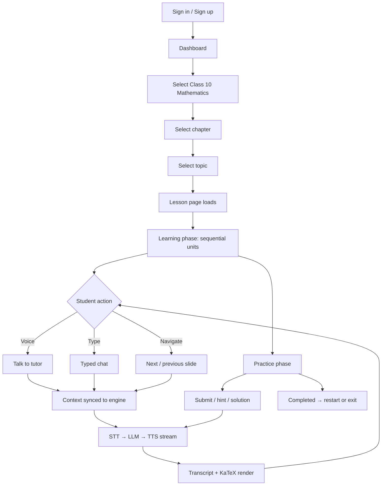
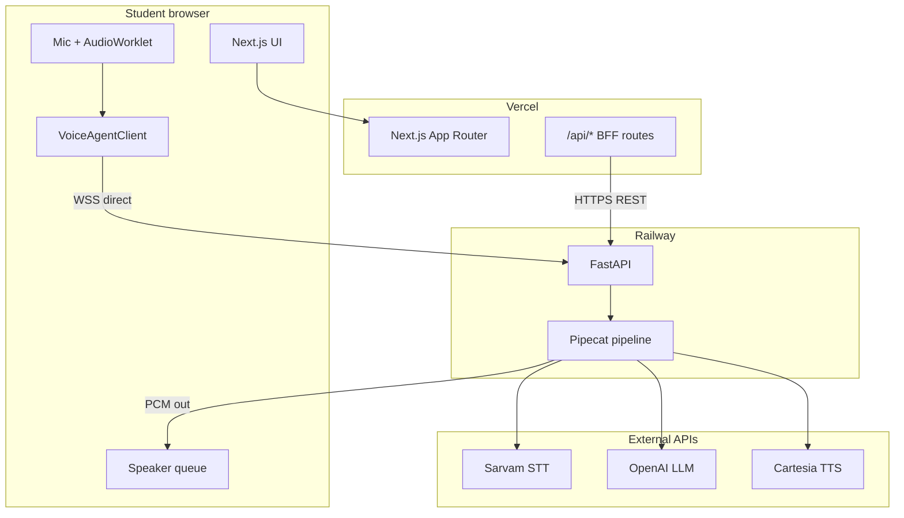
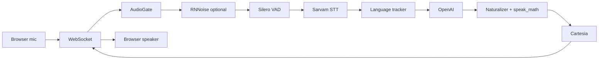
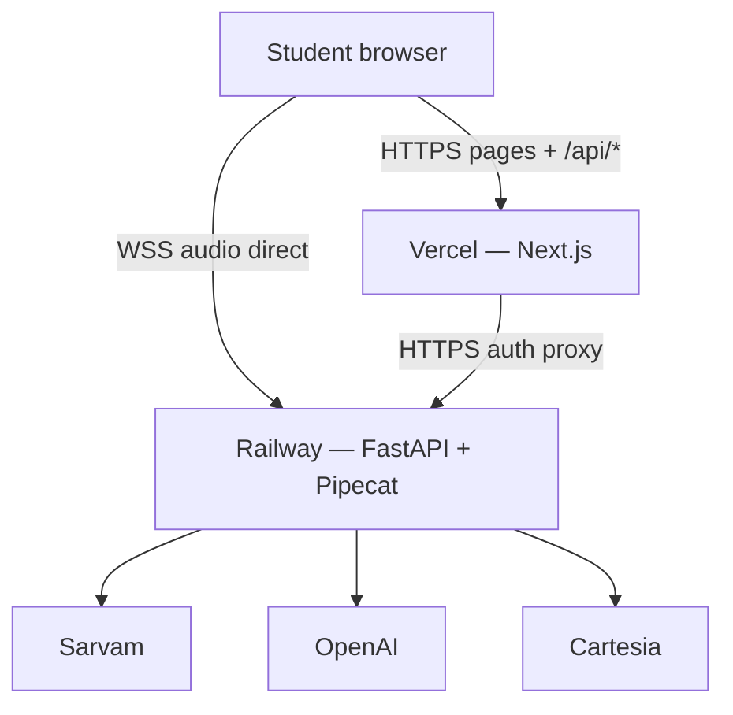

# Lumina

**Class 10 Mathematics voice tutor** — study structured lesson content in the browser, then talk to an AI tutor that understands what you are looking at, explains concepts, answers doubts, and guides practice.

Built as a **real-time voice conversation engine** (not a chatbot with TTS bolted on): streaming duplex audio, true barge-in, context-aware tutoring, and mathematical speech that sounds like a teacher.

| Layer | Path | Deploy target |
|-------|------|---------------|
| **Frontend** | [`tutor-frontend/`](tutor-frontend/) | [Vercel](https://vercel.com) |
| **Backend** | [`server/`](server/) | [Railway](https://railway.com) (Render alternative) |

**Deep dives:** [Architecture](docs/ARCHITECTURE.md) · [Production deployment](docs/deployment.md) · [Long-session QA checklist](docs/LONG_SESSION_TEST_CHECKLIST.md)

---

## Table of contents

1. [Product overview](#1-product-overview)
2. [Key features](#2-key-features)
3. [Product workflow](#3-product-workflow)
4. [System architecture](#4-system-architecture)
5. [Voice pipeline](#5-voice-pipeline)
6. [Interruption / barge-in](#6-interruption--barge-in)
7. [Context-aware tutoring](#7-context-aware-tutoring)
8. [Mathematical speech system](#8-mathematical-speech-system)
9. [Multilingual architecture](#9-multilingual-architecture)
10. [AI / LLM architecture](#10-ai--llm-architecture)
11. [Content architecture](#11-content-architecture)
12. [Frontend architecture](#12-frontend-architecture)
13. [Backend architecture](#13-backend-architecture)
14. [Security](#14-security)
15. [Observability & reliability](#15-observability--reliability)
16. [Performance](#16-performance)
17. [Deployment architecture](#17-deployment-architecture)
18. [Environment variables](#18-environment-variables)
19. [Local development](#19-local-development)
20. [Production deployment](#20-production-deployment)
21. [Testing / QA](#21-testing--qa)
22. [Error & failure behavior](#22-error--failure-behavior)
23. [Project structure](#23-project-structure)
24. [API & WebSocket reference](#24-api--websocket-reference)
25. [Design principles](#25-design-principles)
26. [Roadmap](#26-roadmap)
27. [FAQ](#27-faq)
28. [Troubleshooting](#28-troubleshooting)
29. [Technology stack](#29-technology-stack)
30. [License & credits](#30-license--credits)

---

## 1. Product overview

### What is Lumina?

Lumina is a **context-aware AI tutor** for Indian Class 10 students. It combines NCERT-aligned Mathematics content with a **live voice session** — students read lesson material slide-by-slide and speak naturally to a tutor that knows the current page, topic, and practice question.

### Problem it solves

Traditional LMS tools show static content. Generic chatbots lack lesson context, handle voice poorly, and cannot be interrupted mid-sentence. Lumina targets the gap: **structured learning + natural spoken tutoring** on the same screen.

### Who it is for

- **Students:** Class 10, Mathematics (English UI; multilingual voice)
- **Developers / reviewers:** Full-stack voice-AI system with documented pipeline

### Core experience

```
Student opens lesson
  → reads sequential content (concepts, formulas, examples)
  → current slide becomes tutor context
  → speaks or types a question
  → tutor responds in streaming voice + transcript
  → student can interrupt at any time
  → practice questions with hints (answers never shipped to browser)
  → continues learning
```

### What makes it different

| Typical chatbot / LMS | Lumina |
|----------------------|--------|
| Request/response text | Streaming duplex WebSocket audio |
| No page awareness | Session + learning context injected per slide |
| Cannot interrupt | Client + server barge-in with turn reset |
| Reads markdown aloud | Naturalizer + math-to-speech layer for TTS |
| Single LLM call | Failover chain, dedup, empty-response guard |

---

## 2. Key features

Only capabilities **implemented in this repository** are listed.

### AI tutor

- Real-time voice tutoring over WebSocket
- Contextual tutoring tied to current lesson slide / practice question
- Concept explanations, step-by-step problem solving, doubt clarification
- Hints and practice evaluation (server-side answer secrets)
- Natural follow-up conversation within Class 10 Maths scope
- Off-topic / pivot detection (`PivotDetectorProcessor`)
- FAQ handling (platform questions, e.g. “who made you?”)
- Study break timer (“take a break” / resume)
- Typed chat on the same LLM path as voice

### Real-time voice

- PCM16 mono @ 16 kHz streaming (browser ↔ server)
- WebSocket transport with JSON control + binary audio
- Low-latency interaction (streaming STT, LLM, TTS — no batch-and-play)
- **Barge-in / interruption** (client AudioWorklet + server Silero VAD)
- **Silero VAD** for turn start
- **Smart Turn** (`LocalSmartTurnAnalyzerV3`) for turn end
- **AudioGate** — echo rejection while tutor speaks; loud speech still passes
- **Optional RNNoise** — server-side denoising (`RNNOISE_ENABLED=false` by default)
- Voice connection status banner (lost / reconnecting / connected)
- Auto-reconnect with exponential backoff (client, max 8 attempts)

### Multilingual (voice)

- **Supported session languages:** English (`en-IN`), Hindi (`hi-IN`), Tamil (`ta-IN`), Telugu (`te-IN`)
- Sarvam STT `language=unknown` + `LanguageTrackerProcessor` for detection
- Language persistence with hysteresis (`LANGUAGE_CONFIRMATIONS`)
- Explicit language switch requests honored immediately
- Regional conversational style in tutor prompts
- English technical terms / code-switching supported in prompts
- **UI language:** English only (no i18n framework)
- Default WebSocket param: `lang=auto`

### Mathematics

- KaTeX rendering in transcript UI (display layer)
- Deterministic **math-to-speech** (`speak_math.py`) — no extra LLM for pronunciation
- Fractions, powers, roots, variables, equations → teacher-style spoken English
- Separate **display representation** vs **TTS representation**

### Learning experience

- Slide/page-aware context (`session_context`, `learning_context`)
- Sequential lesson units: overview → concepts → formulas → examples → mistakes
- Practice phase with adaptive difficulty
- Live transcript + typed chat in conversation panel
- Break timer UI
- Five Cartesia voice personas (regional preference labels)

### Safety

- Regex-based safety turn interceptor (no extra LLM on normal turns)
- Self-harm / distress phrasing detection
- Supportive spoken response + `SafetyConcernBanner` in UI
- Session can resume after safety handling

### Reliability

- LLM provider switch: OpenAI default; Groq / Gemini / OpenRouter via `LLM_PROVIDER`
- Sarvam STT reconnect wrapper (WebSocket drop recovery)
- Transcription dedup + LLM inference dedup
- Empty LLM response guard (`LLM_EMPTY_GUARD_TIMEOUT_SECS`, default 20 s + spoken fallback)
- Fail-safe RNNoise passthrough if library unavailable
- Structured ops logging (`ops_log.py`)

---

## 3. Product workflow


```mermaid
flowchart TD
  A[Sign in / Sign up] --> B[Dashboard]
  B --> C[Select Class 10 Mathematics]
  C --> D[Select chapter]
  D --> E[Select topic]
  E --> F[Lesson page loads]
  F --> G[Learning phase: sequential units]
  G --> H{Student action}
  H -->|Voice| I[Talk to tutor]
  H -->|Type| J[Typed chat]
  H -->|Navigate| K[Next / previous slide]
  I --> L[Context synced to engine]
  J --> L
  K --> L
  L --> M[STT → LLM → TTS stream]
  M --> N[Transcript + KaTeX render]
  N --> H
  G --> O[Practice phase]
  O --> P[Submit / hint / solution]
  P --> M
  O --> Q[Completed → restart or exit]
```

**Step-by-step (actual implementation):**

1. Student signs in (`/signin`) — JWT cookies set via Next.js BFF → Railway `/auth/*`
2. Dashboard (`/`) shows Class 10 Mathematics (English is “coming soon” placeholder)
3. Student picks chapter → topic
4. Lesson page loads topic content from `CurriculumService` (public bundle — no answers)
5. **Learning phase:** auto-built units from curriculum (overview, notes, formula board, example, mistakes)
6. On slide change, `useLearningContextSync` sends `learning_context` over WebSocket
7. Student taps **Talk to tutor** → voice ticket minted → WebSocket auth handshake → pipeline starts
8. Student speaks or types; tutor streams reply
9. Student can **interrupt** mid-reply; truncated assistant text dropped from context
10. **Practice phase:** one question at a time; hints/solutions fetched from signed API routes
11. Voice answers in practice route through same text path as typed submit

---

## 4. System architecture


```mermaid
flowchart TB
  subgraph Browser["Student browser"]
    UI[Next.js UI]
    WSClient[VoiceAgentClient]
    Mic[Mic + AudioWorklet]
    Spk[Speaker queue]
  end

  subgraph Vercel["Vercel"]
    Next[Next.js App Router]
    API["/api/* BFF routes"]
  end

  subgraph Railway["Railway"]
    FastAPI[FastAPI]
    Pipe[Pipecat pipeline]
  end

  subgraph External["External APIs"]
    Sarvam[Sarvam STT]
    OpenAI[OpenAI LLM]
    Cartesia[Cartesia TTS]
  end

  UI --> Next
  API -->|HTTPS REST| FastAPI
  WSClient -->|WSS direct| FastAPI
  Mic --> WSClient
  FastAPI --> Pipe
  Pipe --> Sarvam
  Pipe --> OpenAI
  Pipe --> Cartesia
  Pipe -->|PCM out| Spk
```

| Layer | Responsibility |
|-------|----------------|
| **Next.js (Vercel)** | Auth UI, curriculum navigation, lesson UX, BFF proxy to Railway, voice ticket minting |
| **VoiceAgentClient** | WebSocket, mic capture, playback, barge-in, reconnect — **not proxied through Vercel** |
| **FastAPI** | HTTP auth, health/ready, WebSocket `/ws`, static debug UI (dev only) |
| **Pipecat** | Frame-based real-time pipeline orchestration |
| **Processors** | Tutor logic, safety, context, dedup, naturalization — see [§5](#5-voice-pipeline) |
| **External APIs** | STT, LLM, TTS — keys server-side only |

---

## 5. Voice pipeline

**Sample rate:** 16 kHz mono PCM16 end-to-end.  
**Wire format:** binary PCM up/down; JSON control messages with `"type"`.

### Upstream (mic → STT)

| Order | Component | Why it exists |
|-------|-----------|---------------|
| 1 | `transport.input()` | Deserialize WebSocket PCM (512-sample / 32 ms chunks) |
| 2 | `ClientInterruptProcessor` | Browser `{type:"interrupt"}` → pipeline cancellation |
| 3 | `TtsVoiceProcessor` | Voice selection control messages |
| 4 | `SessionContextProcessor` | Session / learning / tutor context from browser |
| 5 | **AudioGate** | Drop quiet echo while bot speaks; pass loud barge-in (RMS ≥ 0.04) |
| 6 | **RNNoise** *(optional)* | Server denoising 16↔48 kHz; **off by default** |
| 7 | **Silero VAD** | Speech start/stop; drives turn boundaries |
| 8 | `TurnResetProcessor` | Remove truncated assistant text after interruption |
| 9 | `SilenceDetectorProcessor` | Long-silence prompts |
| 10 | **Sarvam STT** | Streaming transcription (`saaras:v3`, `language=unknown`) |
| 11 | `TranscriptionDedupProcessor` | Prevent duplicate transcripts |
| 12 | `LanguageTrackerProcessor` | Map STT language → session language + TTS voice hints |
| 13 | `CallMuteProcessor` | Pause during study break |
| 14 | `RepeatDetectorProcessor` | “Say that again” handling |
| 15 | `IncidentalResumeGateProcessor` | Cough/noise vs real speech |
| 16 | `user_aggregator` | Smart Turn stop + context aggregation |

### Downstream (text → speaker)

| Order | Component | Why it exists |
|-------|-----------|---------------|
| 17 | `TextInputProcessor` | Typed chat → same path as voice |
| 18 | `SafetyProcessor` | Crisis phrases → supportive response (regex, not extra LLM) |
| 19 | `StudyBreakProcessor` | Break/resume logic |
| 20 | `TutorTurnProcessor` | Tutor engine directives + scope |
| 21 | `ContextSanitizerProcessor` | Context hygiene |
| 22 | `LLMInferenceDedupProcessor` | Prevent double LLM calls |
| 23 | `PivotDetectorProcessor` | Topic pivot awareness |
| 24 | **LLM service** | OpenAI (`LLM_PROVIDER=openai`); Groq/Gemini/OpenRouter on switch |
| 25 | `ResponseNaturalizerProcessor` | Spoken-style text; invokes math speech |
| 26 | `LLMEmptyGuardProcessor` | Timeout + fallback line if model empty |
| 27 | `TtsApplyVoiceProcessor` | Apply Cartesia voice ID |
| 28 | **Cartesia TTS** | `sonic-3.5` @ 16 kHz |
| 29 | `RTVIProcessor` | Events to browser (speaking, transcription, etc.) |
| 30 | `transport.output()` | PCM to WebSocket |


```mermaid
flowchart LR
  Mic[Browser mic] --> WS[WebSocket]
  WS --> Gate[AudioGate]
  Gate --> Denoise[RNNoise optional]
  Denoise --> VAD[Silero VAD]
  VAD --> STT[Sarvam STT]
  STT --> Lang[Language tracker]
  Lang --> LLM[OpenAI]
  LLM --> Nat[Naturalizer + speak_math]
  Nat --> TTS[Cartesia]
  TTS --> WS
  WS --> Spk[Browser speaker]
```

---

## 6. Interruption / barge-in

Interruption is a **first-class feature**, implemented on both client and server.

### Client path

1. **AudioWorklet** (`public/audio-processor.js`) runs local VAD (RMS + spectral centroid 300–3400 Hz)
2. When user speaks while bot audio plays → immediate **playback flush**
3. Debounced `{type:"interrupt"}` JSON to server (220 ms debounce, 400 ms min bot speak time)
4. On RTVI `userStartedSpeaking` from server → local flush without duplicate interrupt (800 ms dedup)

### Server path

1. `ClientInterruptProcessor` broadcasts Pipecat interruption
2. **Silero VAD** detects user speech during bot turn
3. **AudioGate** passes frames with RMS ≥ 0.04 during bot speech
4. `PipelineParams(allow_interruptions=True)` propagates cancellation
5. **TurnResetProcessor** drops partial assistant message from LLM context
6. **IncidentalResumeGateProcessor** filters cough/noise; **IncidentalResumeCaptureProcessor** can resume truncated TTS remainder when appropriate

---

## 7. Context-aware tutoring

The tutor is **not** a generic chatbot. Context arrives over the WebSocket as JSON control frames:

| Message | Content | Visibility |
|---------|---------|------------|
| `session_context` | Class, subject, chapter, topic IDs and titles | Tutor + LLM |
| `learning_context` | Current slide type, visible text, practice question stem | Tutor + LLM |
| `tutor_context` | Hints, expected answer, solution (HMAC-signed) | Tutor only — never in student UI bundle |

**Flow:**

1. Topic page builds `TutorSessionContext` via `CurriculumService`
2. `toPublicTopic()` strips secrets before sending to browser
3. `useLearningContextSync` pushes updates on slide navigation
4. `/api/tutor-context` returns signed tutor-only payload for hints/solutions
5. `SessionContextProcessor` sanitizes and injects `[SESSION_CONTEXT]` / `[LEARNING_CONTEXT]` system notes
6. `TutorTurnProcessor` applies tutor engine policy on top of context

---

## 8. Mathematical speech system

Two representations are intentionally separated:

| Layer | Used for | Example |
|-------|----------|---------|
| **Display** | Transcript UI (KaTeX) | `$x^2$`, `\frac{a}{b}` |
| **Speech** | Cartesia TTS input | “x squared”, “a divided by b” |

**Implementation:** `server/processors/speak_math.py` — deterministic regex/transform pipeline called from `ResponseNaturalizerProcessor`. **No extra LLM call** for pronunciation.

Examples handled in tests:

- `x²` → “x squared”
- `√x` → “the square root of x”
- `\frac{a}{b}` → “a divided by b”
- Variables spelled letter-by-letter when needed (`_LETTER_NAMES` map)

---

## 9. Multilingual architecture

### Supported languages (voice session)

| Code | Language |
|------|----------|
| `en-IN` | English |
| `hi-IN` | Hindi |
| `ta-IN` | Tamil |
| `te-IN` | Telugu |

Defined in `server/languages.py` as `SUPPORTED_LANGUAGES`.

### Pipeline behavior

1. **Sarvam STT** transcribes with auto language detection
2. **LanguageTrackerProcessor** updates session language with confidence + hysteresis
3. Explicit student requests (“speak in Hindi”) switch immediately
4. **Tutor prompts** include per-language style blocks
5. **ResponseNaturalizer** picks Hindi/English conversational starters
6. **Cartesia TTS** language updated mid-session via `Settings.language`

### Voice selection (UI)

Five Cartesia voices (Riya, Akshara, Shanti, Vishal, Dev) — labeled with regional preference; any voice can be used with any supported spoken language.

---

## 10. AI / LLM architecture

| Setting | Value |
|---------|-------|
| **Primary** | OpenAI — `gpt-5.6-luna` (`LLM_PROVIDER=openai`) |
| **Optional switch** | `LLM_PROVIDER=groq` / `gemini` / `openrouter` (needs that provider's key) |
| **Temperature** | 0.6 |
| **Max tokens** | 384 completion |

There is no Cerebras path and no `FailoverLLMService`. Empty output is handled by `LLMEmptyGuardProcessor` (`LLM_EMPTY_GUARD_TIMEOUT_SECS`, default 20).

**Prompt strategy:** Class 10 maths tutor system prompt + injected context markers + tutor turn directives. Not documented verbatim here (see `server/tutor/prompts.py`).

**Dedup:** `TranscriptionDedupProcessor`, `LLMInferenceDedupProcessor` — prevent double answers from racing turn detectors.

**Naturalization:** Strips markdown, bullet lists, disclaimers; applies math speech before TTS.

---

## 11. Content architecture

```
Class 10
  └── Mathematics (available)
        ├── Real Numbers (3 topics)
        ├── Polynomials (3 topics)
        ├── Pair of Linear Equations (4 topics)
        └── Quadratic Equations (4 topics)
              └── Topic
                    ├── conceptNotes, keyPoints, formulas
                    ├── worked examples, commonMistakes
                    └── practiceQuestions[] (with difficulty, hints, expectedAnswer)
```

**Source:** `tutor-frontend/src/content/curriculum/class10/mathematics/`  
**Access:** `CurriculumService` singleton — validated at startup via `validateContent.ts`

**Security:** `toPublicTopic()` removes hints, expected answers, and solutions from client bundles. Practice secrets served only via authenticated `/api/practice/*` and signed `tutor_context`.

---

## 12. Frontend architecture

**Stack:** Next.js 15 App Router, React 19, TypeScript, Tailwind CSS 4, KaTeX.

| Area | Location |
|------|----------|
| Routes | `src/app/` — dashboard, auth, subject/chapter/topic hierarchy |
| API BFF | `src/app/api/` — auth, voice session, practice, tutor-context |
| Voice client | `src/lib/voice/VoiceAgentClient.ts` + `useVoiceSession` hook |
| Voice config | `src/lib/config.ts` — WebSocket URL centralization |
| Backend proxy | `src/lib/api.ts` → `src/lib/server/backendApi.ts` |
| Curriculum | `src/content/curriculum/`, `src/services/curriculum/` |
| Domain logic | `src/domain/lesson/`, `src/domain/practice/`, `src/domain/curriculum/` |
| Lesson UI | `src/components/lesson/` — voice dock, practice card, conversation panel |
| Auth | `src/middleware.ts`, HttpOnly cookies, `SessionKeepAlive` |

**State:** React hooks (`useLessonFlow`, `useVoiceSession`, `useLearningContextSync`) — no global Redux store.

**Responsive:** App shell + lesson split layout; conversation panel alongside content.

---

## 13. Backend architecture

**Stack:** FastAPI, Pipecat 1.5, Python 3.12, loguru.

| Area | Location |
|------|----------|
| Entry | `server/main.py` — HTTP + WebSocket |
| Pipeline | `server/pipeline.py` — `create_pipeline()` |
| Processors | `server/processors/` (23 modules) |
| Services | `server/services/` — STT reconnect, LLM failover |
| Auth | `server/auth/` — routes, SQLite store, JWT, Argon2 |
| Security | `server/security.py` — tickets, CORS origin, rate limits |
| Config | `server/config.py` — env-driven settings |
| Tutor engine | `server/tutor/` — prompts, FAQ, safety patterns |
| Audio | `server/audio/` — optional RNNoise |
| Tests | `server/tests/` — 34 test modules, **397 tests** |

**Session model:** One WebSocket connection = one Pipecat pipeline instance with isolated processor state.

---

## 14. Security

### Implemented

| Mechanism | Detail |
|-----------|--------|
| **Authentication** | Email/password signup & signin |
| **Password hashing** | Argon2id + policy (8+ chars, mixed case, digit, special) |
| **JWT access tokens** | 15 min, HS256, iss/aud/exp validation |
| **Refresh tokens** | 14 days, rotated, family revocation on reuse |
| **WebSocket auth** | Single-use voice ticket in first message — **never in URL** |
| **CORS** | Explicit `FRONTEND_ORIGIN` in production; wildcard blocked |
| **CSRF** | Same-origin check on mutating Next.js API routes |
| **Rate limits** | Auth endpoints + WS connect rate (Redis or SQLite fallback) |
| **Input sanitization** | Control-marker stripping, field length caps |
| **Practice secrets** | Server-only; HMAC-signed tutor context |
| **Env secrets** | `.env` gitignored; no keys in `NEXT_PUBLIC_*` |
| **Production WSS** | Build/runtime validation — `wss://` required in production |

### Recommended for future production hardening

- PostgreSQL for durable user accounts (SQLite is ephemeral on Railway)
- Redis required (not optional) for multi-instance rate limits + voice JTI
- JWT validation in Next.js middleware (currently cookie presence only)
- Centralized monitoring / alerting (not implemented)
- Secret rotation runbook

---

## 15. Observability & reliability

| Capability | Status |
|------------|--------|
| **Structured ops logs** | JSON `ops` events via loguru (`ws_open`, `stt_reconnect_*`, `llm_request_failure`, etc.) |
| **`GET /health`** | Process alive — no external API calls |
| **`GET /ready`** | API keys + production config blockers (Railway healthcheck). Does not echo `LLM_PROVIDER`. |
| **LLM provider** | OpenAI default; optional Groq/Gemini/OpenRouter via `LLM_PROVIDER` |
| **STT reconnect** | `ReconnectingSarvamSTTService` on Sarvam WebSocket drop |
| **Empty LLM guard** | `LLM_EMPTY_GUARD_TIMEOUT_SECS` (default 20) + spoken fallback |
| **Voice connection UI** | Banner on WebSocket failure / reconnect |
| **TTS failure ops event** | Not implemented (would need pipeline hook) |
| **Metrics dashboard** | **Planned** — not implemented |
| **Sentry / Datadog** | **Planned** — not implemented |

Logs go to **stdout/stderr** (Railway-compatible). No secrets, JWTs, or audio in ops logs.

---

## 16. Performance

### Architecture choices

- **Streaming audio** over WebSocket — not request/response HTTP for voice
- **Direct browser → Railway WSS** — Vercel not in the audio path
- **Streaming LLM + TTS** — frames forwarded as produced
- **VAD-driven turns** — no polling for speech detection
- **Deterministic math speech** — zero extra LLM calls for pronunciation
- **RNNoise** — optional; fail-safe passthrough; frame-based (~10 ms frames at 48 kHz internal)

### Measured benchmark (optional RNNoise)

From `server/scripts/benchmark_rnnoise.py` on a development machine:

| Metric | Passthrough | RNNoise enabled |
|--------|-------------|-----------------|
| Avg per 512-sample frame | ~0.2 µs | ~2.65 ms |
| p95 | ~0.3 µs | ~5.1 ms |

RNNoise adds negligible latency relative to STT/LLM/TTS; left **disabled by default** for A/B validation.

End-to-end turn latency is dominated by external APIs — no invented p50/p95 numbers for full conversations.

---

## 17. Deployment architecture


```mermaid
flowchart TB
  Browser[Student browser]
  Vercel[Vercel — Next.js]
  Railway[Railway — FastAPI + Pipecat]
  Sarvam[Sarvam]
  OpenAI[OpenAI]
  Cartesia[Cartesia]

  Browser -->|HTTPS pages + /api/*| Vercel
  Browser -->|WSS audio direct| Railway
  Vercel -->|HTTPS auth proxy| Railway
  Railway --> Sarvam
  Railway --> OpenAI
  Railway --> Cartesia
```

**Why WebSocket bypasses Vercel:** Real-time PCM cannot be proxied through serverless functions without unacceptable latency and cost. Only auth/tickets use the Next.js BFF.

Full step-by-step: **[docs/deployment.md](docs/deployment.md)**

---

## 18. Environment variables

### Backend (Railway / `server/`)

| Variable | Required (prod) | Scope | Description |
|----------|-----------------|-------|-------------|
| `ENVIRONMENT` | yes | server | `production` enables strict mode |
| `SESSION_SECRET` | yes | server | Signs voice tickets, tutor context HMAC |
| `AUTH_SECRET` | optional | server | JWT key; defaults to `SESSION_SECRET` |
| `FRONTEND_ORIGIN` | yes | server | Vercel origin(s) for CORS + WS origin check |
| `SARVAM_API_KEY` | yes | server | STT |
| `OPENAI_API_KEY` | yes | server | LLM (`LLM_PROVIDER=openai`) |
| `CARTESIA_API_KEY` | yes | server | TTS |
| `LLM_PROVIDER` | yes | server | Default `openai`. Set explicitly so leftover Groq/Cerebras values cannot win. |
| `LLM_MODEL` | optional | server | Default `gpt-5.6-luna` when provider is openai |
| `REDIS_URL` | yes | server | Shared auth rate limits / tickets. App currently *warns* if unset; still required here. |
| `ALLOW_ANONYMOUS_WS` | yes (`0`) | server | Must be off in production |
| `ENABLE_DEMO_LOGIN` | yes (unset/`0`) | server | Must be unset or false in prod |
| `CALL_MUTE_TIMEOUT_SECS` | no | server | Default `40` |
| `CALL_MUTE_RESUME_MIN_WORDS` | no | server | Default `6` |
| `AWAITING_TIMEOUT_SECS` | no | server | Default `40` |
| `AWAITING_MISS_RESUME_AFTER` | no | server | Default `3` |
| `LLM_EMPTY_GUARD_TIMEOUT_SECS` | no | server | Default `20` |
| `TTS_FALLBACK_PROVIDER` | optional | server | `openai` for Cartesia 402 failover |
| `GROQ_API_KEY` | optional | server | Only if `LLM_PROVIDER=groq` |
| `GEMINI_API_KEY` | optional | server | Only if `LLM_PROVIDER=gemini` |
| `OPENROUTER_API_KEY` | optional | server | Only if `LLM_PROVIDER=openrouter` |
| `RNNOISE_ENABLED` | no | server | `false` default |
| `HOST` / `PORT` | auto | server | Railway injects `PORT`; bind `0.0.0.0` |
| `MAX_CONCURRENT_SESSIONS` | no | server | Default 20 |
| `MAX_CONNECTS_PER_IP_PER_MIN` | no | server | Default 8 |
| `JWT_ISSUER` / `JWT_AUDIENCE` | no | server | Default `lumina` / `lumina-app` |
| `ACCESS_TTL_SECS` / `REFRESH_TTL_SECS` | no | server | Token lifetimes |
| `DEFAULT_SESSION_LANGUAGE` | no | server | Default `en-IN` |
| `LANGUAGE_*` | no | server | Detection tuning |
| `AUTH_DB_PATH` | no | server | SQLite path (default `server/data/auth.sqlite`) |
| `DEBUG_TTS_INPUT` | no | server | Dev-only TTS debug |

Do not set `CEREBRAS_API_KEY`. There is no Sentry DSN in `config.py`.

Template: [`.env.example`](.env.example). Inventory also in [`railway.toml`](railway.toml) comments and [`docs/deployment.md`](docs/deployment.md).

### Frontend (Vercel / `tutor-frontend/`)

| Variable | Required (prod) | Scope | Description |
|----------|-----------------|-------|-------------|
| `NEXT_PUBLIC_VOICE_WS_URL` | yes | **browser-safe** | `wss://YOUR-SERVICE.up.railway.app/ws` |
| `NEXT_PUBLIC_VOICE_LANG` | no | browser-safe | Default `auto` |
| `VOICE_API_URL` | yes | server-only | `https://YOUR-SERVICE.up.railway.app` |
| `SESSION_SECRET` | yes | server-only | Must match Railway |
| `AUTH_SECRET` | optional | server-only | JWT verification |

Template: [`tutor-frontend/.env.example`](tutor-frontend/.env.example)

**Rule:** Never put API keys or signing secrets in `NEXT_PUBLIC_*`.

---

## 19. Local development

### Prerequisites

- **Python 3.12** (3.13 not supported by current pins)
- **Node.js 20+**
- API keys: Sarvam, OpenAI, Cartesia

### Backend

```bash
cd real-time-live-agent
cp .env.example .env
# Fill SARVAM_API_KEY, OPENAI_API_KEY, CARTESIA_API_KEY, SESSION_SECRET, LLM_PROVIDER=openai

pip install -r requirements.txt

cd server
uvicorn main:app --reload --host 0.0.0.0 --port 8805
```

| Check | URL |
|-------|-----|
| Health | http://127.0.0.1:8805/health |
| Readiness | http://127.0.0.1:8805/ready |
| WebSocket | ws://127.0.0.1:8805/ws |

### Frontend

```bash
cd tutor-frontend
cp .env.example .env.local
# Match SESSION_SECRET with backend .env

npm ci
npm run dev
```

Open **http://localhost:3000**

### Run tests

```bash
# Backend (from server/)
pytest -q

# Frontend (from tutor-frontend/)
npm run lint
npm run typecheck
npm test
npm run build
```

CI runs both on push/PR via [`.github/workflows/ci.yml`](.github/workflows/ci.yml).

---

## 20. Production deployment

### Backend → Railway

1. Connect GitHub repo; [`railway.toml`](railway.toml) supplies builder, start command, and `GET /ready` healthcheck
2. **Root directory:** `.` (repo root)
3. **Start:** `uvicorn main:app --host 0.0.0.0 --port $PORT --app-dir server` (already in `railway.toml`)
4. **RAM:** ≥2 GB — torch + Silero need memory
5. Set dashboard secrets from [§18](#18-environment-variables): `OPENAI_API_KEY`, `SARVAM_API_KEY`, `CARTESIA_API_KEY`, `SESSION_SECRET`, `FRONTEND_ORIGIN`, `REDIS_URL`, `ENVIRONMENT=production`, `LLM_PROVIDER=openai`, `ALLOW_ANONYMOUS_WS=0`, `ENABLE_DEMO_LOGIN=0`
6. Confirm `https://YOUR-SERVICE.up.railway.app/ready` returns ready (will 503 until keys + `FRONTEND_ORIGIN` + `SESSION_SECRET` are set)

Render remains an alternative via [`render.yaml`](render.yaml) (`GET /health` liveness, not `/ready`).

### Frontend → Vercel

1. Import repo; set **Root Directory** = `tutor-frontend`
2. Set env vars (see [§18](#18-environment-variables))
3. Deploy; note Vercel URL
4. Set Railway `FRONTEND_ORIGIN=https://YOUR-APP.vercel.app`
5. **Restart Railway** after CORS change
6. Test sign-in → lesson → **Talk to tutor**

Detailed guide: **[docs/deployment.md](docs/deployment.md)**

---

## 21. Testing / QA

### Automated

| Suite | Command | Count |
|-------|---------|-------|
| Backend | `cd server && pytest -q` | 397 tests |
| Frontend unit | `cd tutor-frontend && npm test` | Vitest (protocol, voice, lesson flow, auth helpers) |
| CI | GitHub Actions | lint + typecheck + test + build |

### Manual regression checklist

**Voice**

- [ ] Connect, speak, receive transcript + TTS
- [ ] Interrupt mid-sentence (barge-in)
- [ ] 5+ minute session without silent stall
- [ ] WebSocket reconnect banner appears on disconnect

**Tutor**

- [ ] Tutor references current slide content
- [ ] Doubt on visible formula/example
- [ ] Practice hint without revealing answer in UI
- [ ] Typed chat works alongside voice

**Language**

- [ ] Hindi ↔ English switch mid-session
- [ ] Tamil / Telugu transcription (if available in Sarvam)

**Mathematics**

- [ ] Fractions and powers spoken naturally in TTS
- [ ] KaTeX renders correctly in transcript

**Security**

- [ ] Unauthenticated routes redirect to sign-in
- [ ] Voice session requires login (401 without cookie)
- [ ] WebSocket rejects `?token=` query param

**UI**

- [ ] Dashboard → chapter → topic navigation
- [ ] Lesson next/previous; practice gating
- [ ] Mobile viewport usable

Full long-session matrix: **[docs/LONG_SESSION_TEST_CHECKLIST.md](docs/LONG_SESSION_TEST_CHECKLIST.md)**

---

## 22. Error & failure behavior

| Failure | Behavior |
|---------|----------|
| **Sarvam STT drop** | `ReconnectingSarvamSTTService` reconnects; ops `stt_reconnect_*` logs |
| **LLM provider error** | Ops `llm_request_failure`; empty guard may speak a fallback |
| **All LLMs fail** | Error re-raised; `LLMEmptyGuard` speaks fallback line |
| **Empty LLM output** | `LLM_EMPTY_GUARD_TIMEOUT_SECS` (default 20) → injected spoken fallback |
| **TTS error** | Pipeline error logged; user may hear silence for that turn |
| **WebSocket disconnect** | Client reconnect backoff; banner “Voice connection lost” |
| **WS auth failure** | Close 4401; user must End → Talk again |
| **RNNoise failure** | Passthrough original PCM; session continues |
| **Auth failure** | Generic “invalid credentials”; no email enumeration |
| **User interrupts** | Playback stops; partial assistant text removed from context |
| **Safety phrase** | Supportive response + banner; tutoring can resume |

---

## 23. Project structure

```
real-time-live-agent/
├── tutor-frontend/          # Next.js → Vercel
│   ├── src/app/             # Routes + API BFF
│   ├── src/components/      # UI (lesson, auth, dashboard)
│   ├── src/content/         # Curriculum data (Class 10 Maths)
│   ├── src/domain/          # Lesson flow, practice, curriculum types
│   ├── src/lib/voice/       # VoiceAgentClient, protocol
│   ├── src/hooks/           # useVoiceSession, useLessonFlow
│   └── public/              # audio-processor.js (AudioWorklet)
├── server/                  # FastAPI + Pipecat → Railway
│   ├── main.py              # HTTP + WebSocket entry
│   ├── pipeline.py          # Pipecat pipeline assembly
│   ├── processors/          # Frame processors (23 modules)
│   ├── services/            # STT reconnect, LLM failover
│   ├── auth/                # User auth (SQLite)
│   ├── tutor/               # Prompts, FAQ, safety
│   ├── audio/               # Optional RNNoise
│   └── tests/               # Pytest suite
├── docs/                    # deployment.md, ARCHITECTURE.md, QA checklists
├── requirements.txt         # Python deps (Railway / Render build)
├── railway.toml             # Railway config-as-code (healthcheck GET /ready)
├── render.yaml              # Render Blueprint (alternative; healthcheck GET /health)
└── .github/workflows/ci.yml
```

Legacy debug client in `client/` — not the product UI.

---

## 24. API & WebSocket reference

### HTTP (FastAPI)

| Method | Path | Auth | Purpose |
|--------|------|------|---------|
| `GET` | `/health` | None | Liveness probe |
| `GET` | `/ready` | None | Readiness (keys + prod config) |
| `POST` | `/auth/signup` | None | Create account |
| `POST` | `/auth/signin` | None | Sign in → tokens |
| `POST` | `/auth/refresh` | Refresh body | Rotate tokens |
| `POST` | `/auth/signout` | Optional Bearer | Revoke refresh family |
| `GET` | `/auth/me` | Bearer JWT | Current user id |
| `POST` | `/auth/voice-ticket` | Bearer JWT | Mint single-use WS ticket |

### Next.js BFF (same-origin)

| Method | Path | Auth | Proxies to |
|--------|------|------|------------|
| `POST` | `/api/auth/signin` | Public | Railway `/auth/signin` |
| `POST` | `/api/auth/signup` | Public | Railway `/auth/signup` |
| `POST` | `/api/auth/refresh` | Cookie | Railway `/auth/refresh` |
| `POST` | `/api/auth/signout` | Cookie | Railway `/auth/signout` |
| `GET` | `/api/auth/me` | Cookie | Railway `/auth/me` |
| `POST` | `/api/voice/session` | Cookie | Voice ticket for WebSocket |
| `POST` | `/api/tutor-context` | Cookie | Signed tutor context |
| `POST` | `/api/practice/evaluate` | Cookie | Answer evaluation |
| `POST` | `/api/practice/hint` | Cookie | Hint text |
| `POST` | `/api/practice/solution` | Cookie | Solution reveal |

### WebSocket

| Path | Auth | Protocol |
|------|------|----------|
| `/ws` | Voice ticket in first JSON frame | Binary PCM16 + JSON control |

**Control message types (client → server):** `auth`, `session_context`, `learning_context`, `tutor_context`, `text_input`, `interrupt`, `tts_voice`

**Close codes:** 4401 unauthorized · 4403 origin · 4408 not ready · 4429 rate limit · 1013 capacity

---

## 25. Design principles

1. **Real-time first** — streaming frames, not batch audio
2. **Context-aware tutoring** — lesson slide is part of the prompt
3. **Natural conversation** — spoken-style naturalizer, not markdown read aloud
4. **Fail safely** — RNNoise, STT, LLM degrade gracefully
5. **Minimal latency** — direct WSS; no Vercel audio proxy
6. **Separation of concerns** — display math ≠ spoken math; public topic ≠ tutor secrets
7. **Secure by default** — production blocks wildcard CORS and anonymous WS
8. **No unnecessary LLM calls** — safety regex, deterministic math speech
9. **Preserve student context** — interruption resets partial reply, not session
10. **Graceful degradation** — failover chain, empty guard, reconnect wrappers

---

## 26. Roadmap

### Currently implemented

Everything listed in [§2 Key features](#2-key-features).

### Future / production hardening (not yet implemented)

| Item | Status |
|------|--------|
| PostgreSQL user storage | **Planned** — SQLite ephemeral on Railway |
| Redis required for multi-instance | **Planned** — optional today |
| Metrics dashboard (p50/p95 latency) | **Planned** |
| TTS failure structured logging | **Planned** |
| Additional subjects (English Class 10) | **Planned** — placeholder in catalog |
| E2E tests (Playwright) | **Planned** |
| JWT validation in Next.js middleware | **Planned** |
| RNNoise enabled by default in production | **Pending validation** — off by default |

---

## 27. FAQ

**How does voice communication work?**  
Browser captures PCM16 @ 16 kHz via AudioWorklet, sends binary frames over WebSocket to Railway. Pipecat pipeline runs STT → LLM → TTS; audio streams back on the same socket.

**How does interruption work?**  
Client flushes playback and sends `interrupt`; server Silero VAD + AudioGate + Pipecat cancellation stop TTS; `TurnResetProcessor` cleans partial assistant context.

**How does current-page context reach the LLM?**  
`useLearningContextSync` sends `learning_context` JSON when the student navigates slides. `SessionContextProcessor` injects sanitized system notes before the LLM turn.

**How is math pronounced?**  
Transcript keeps KaTeX. `speak_math.py` transforms LLM text to spoken English before Cartesia TTS — separate from display rendering.

**How does multilingual support work?**  
Sarvam auto-detects language; `LanguageTrackerProcessor` updates session language (`en-IN`, `hi-IN`, `ta-IN`, `te-IN`). Prompts and naturalizer adapt; TTS language updates mid-session.

**What happens if the LLM fails?**  
There is no multi-provider failover chain. OpenAI is the production provider. `LLMEmptyGuardProcessor` speaks a fallback if the model returns empty (`LLM_EMPTY_GUARD_TIMEOUT_SECS`, default 20). Optional: set `LLM_PROVIDER` to groq / gemini / openrouter and the matching key.

**Where are secrets stored?**  
Backend `.env` (Railway dashboard). Frontend `.env.local` (Vercel dashboard) — only `SESSION_SECRET` and `VOICE_API_URL` server-side; API keys never in the browser.

**How do I deploy?**  
See [§20](#20-production-deployment) and [docs/deployment.md](docs/deployment.md).

**How do I debug a voice connection?**  
Check browser DevTools → Network → WS. Verify `NEXT_PUBLIC_VOICE_WS_URL`, matching `SESSION_SECRET`, and Railway `FRONTEND_ORIGIN`. Look for ops logs: `ws_auth_failure`, `ws_open`.

**How do I add a new topic?**  
Add content under `tutor-frontend/src/content/curriculum/class10/mathematics/chapters/` and register in `catalog.ts`. Run frontend validation tests.

---

## 28. Troubleshooting

| Symptom | Likely cause | Fix |
|---------|--------------|-----|
| 401 on voice session | `SESSION_SECRET` mismatch | Align Vercel + Railway secrets; restart both |
| WebSocket close 4403 | Wrong origin | Set `FRONTEND_ORIGIN` to exact Vercel URL; restart Railway |
| WebSocket close 4408 | Missing API keys or prod config | Check `/ready` in dev; fill Railway env |
| CORS error on sign-in | `FRONTEND_ORIGIN` unset/wrong | Set on Railway |
| Vercel build fails | `ws://` in production WS URL | Use `wss://` for `NEXT_PUBLIC_VOICE_WS_URL` |
| Mic permission error | Browser blocked mic | Allow mic; close other apps using mic |
| No STT transcripts | Sarvam key or STT disconnect | Check Railway logs for `stt_connection_failure` |
| No TTS audio | Cartesia key or pipeline error | Check `/ready`; Railway logs |
| Env change ignored | Next.js caches env at start | Redeploy / restart `next dev` |
| Users lost after deploy | SQLite on ephemeral disk | Expected until Postgres migration |

---

## 29. Technology stack

| Layer | Technology | Purpose |
|-------|------------|---------|
| Frontend | Next.js 15, React 19, TypeScript | Learning UI + BFF |
| Styling | Tailwind CSS 4 | Layout and components |
| Math display | KaTeX | Transcript rendering |
| Backend | FastAPI, Uvicorn | HTTP + WebSocket server |
| Voice orchestration | Pipecat 1.5 | Real-time frame pipeline |
| STT | Sarvam (`saaras:v3`) | Speech recognition |
| LLM (primary) | OpenAI (`gpt-5.6-luna`, `LLM_PROVIDER=openai`) | Tutor reasoning |
| LLM (optional) | Groq / Gemini / OpenRouter | Manual `LLM_PROVIDER` switch |
| TTS | Cartesia (`sonic-3.5`) | Speech synthesis |
| VAD | Silero (via Pipecat) | Speech detection |
| Turn detection | LocalSmartTurnAnalyzerV3 | End-of-turn |
| Noise suppression | RNNoise (optional, `pyrnnoise`) | Server-side denoising |
| Auth | Argon2id, PyJWT, SQLite | User sessions |
| CI | GitHub Actions | lint, test, build |

---

## 30. License & credits

Built on [Pipecat](https://github.com/pipecat-ai/pipecat) with [Sarvam](https://www.sarvam.ai/), [OpenAI](https://openai.com/), and [Cartesia](https://cartesia.ai/).

---

<p align="center">
  <sub>
    Lumina — context-aware Class 10 maths tutoring with a voice that listens, explains, and lets you interrupt.
  </sub>
</p>
