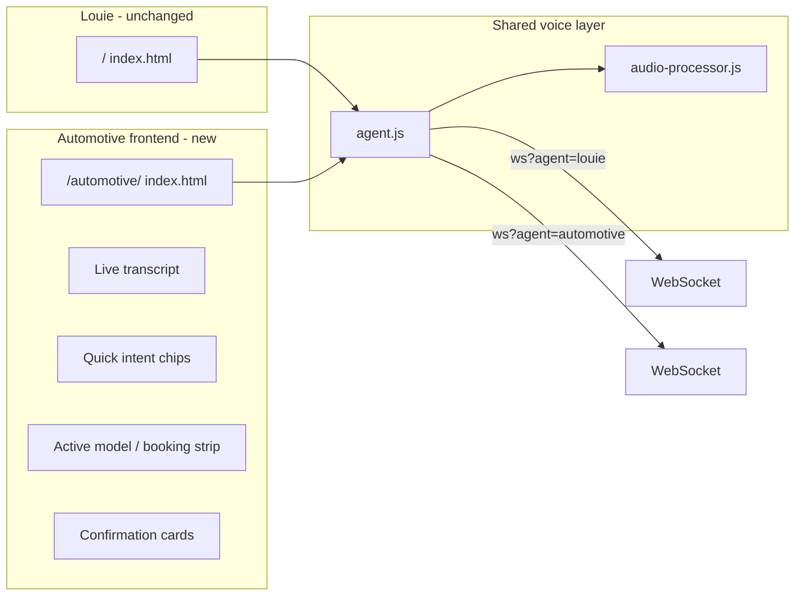
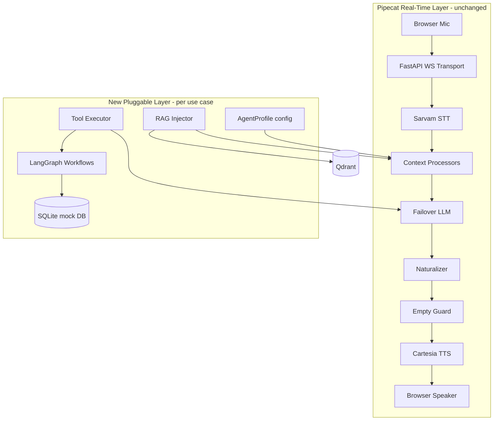

# Automotive Ticket-Resolution Voice Agent (RAG + Same Pipeline)

Implementation plan for extending the existing Pipecat voice agent with an automotive/ticket-resolution profile while keeping the current voice pipeline intact.

**Scope decisions:**
- Same voice pipeline; swap prompts/RAG/tools per use case via agent profiles
- Phase 1 backend: local SQLite + mock APIs
- Pipecat = real-time orchestrator; LangGraph only behind tools for transactional flows
- **Separate automotive frontend** — Louie demo page stays untouched; car instance gets its own UI

---

## Frontend for the automotive instance (build before backend RAG/tools)

Yes — you need a dedicated car-company frontend **before** wiring Pipecat + LangGraph + RAG. The current [`client/index.html`](client/index.html) is a minimal Louie demo (orb + connect/disconnect). It is not suitable as a dealership voice showroom.

### Strategy: shared voice core, separate branded page

Do **not** modify the Louie page. Add a sibling automotive experience that reuses the existing voice stack:

```
client/
├── agent.js                 # shared WebSocket + mic + playback (unchanged)
├── audio-processor.js       # shared AudioWorklet (unchanged)
├── index.html               # Louie demo — leave as-is
└── automotive/
    ├── index.html           # dealership voice showroom
    ├── automotive.js        # UIVoiceAgent subclass + transcript + chips
    └── styles.css           # mobile-first dealership branding
```

Server already mounts `client/` at `/`, so the automotive page is served at:

**`http://localhost:8805/automotive/`**

WebSocket for the car instance:

```javascript
// automotive.js
const wsUrl = `ws://${location.host}/ws?agent=automotive&lang=${lang}`;
```

### What the automotive frontend must show

| UI area | Purpose | Maps to flow |
|---------|---------|--------------|
| **Hero + branding** | Dealership name, tagline ("Talk to our car expert") | 4a discovery |
| **Voice orb / state** | listening / thinking / speaking (reuse orb pattern) | all flows |
| **Language toggle** | en-IN / hi-IN (Hinglish use case) | 4a, 4d |
| **Live transcript** | user + bot text via `_onTranscription()` hook in `agent.js` | trust + debugging |
| **Quick-start chips** | tap-to-speak prompts: Compare Creta vs Verna, Book service, Test drive, EMI, Parts, Roadside | 4a–4f entry points |
| **Active context strip** | shows detected model / booking step (e.g. "Creta · Service booking") | pivot + session continuity |
| **Confirmation card** | when a tool completes (appointment booked, ticket created) | 4b, 4c, 4f, 4g |
| **Mobile-first layout** | large connect button, no tiny text — hands-free while commuting | 4a |



### What stays in `agent.js` vs automotive-only

**Keep in shared `agent.js` (no breaking changes):**
- WebSocket lifecycle, PCM streaming, barge-in, playback queue
- RTVI event parsing (`user-transcription`, `bot-started-speaking`, etc.)
- Lifecycle hooks: `_onTranscription`, `_onThinking`, `_onConnected`, …

**Add only in `automotive/automotive.js`:**
- Branded UI wiring
- Transcript panel (append user + bot lines)
- Quick chips that optionally pre-fill or nudge first utterance (user still speaks — voice-first)
- Read `?lang=` from URL or toggle
- Poll/fetch confirmation cards from REST once backend exists (`GET /api/tickets?session=…`)

**Optional small addition to `agent.js` (non-breaking):**
- Accept WebSocket URL in constructor (already does) — automotive page passes the `agent=automotive` URL
- Add `_onBotTranscription(text)` hook if backend later streams bot text via RTVI (today only user transcription is wired)

### Admin frontend (later, Phase 5)

Separate lightweight page for demo data setup — not part of the customer-facing showroom:

```
client/admin/
  index.html    # upload brochure PDF, sync inventory CSV, view tickets
```

Uses REST (`POST /admin/documents/upload`) — no voice on this page.

### Frontend implementation phases (do these first)

#### Phase 0 — Automotive voice showroom UI (1–2 days)
- [ ] Create `client/automotive/index.html` + `styles.css` + `automotive.js`
- [ ] Reuse `VoiceAgent` from `../agent.js`; connect with `?agent=automotive`
- [ ] Add en-IN / hi-IN language selector
- [ ] Live transcript panel using `_onTranscription`
- [ ] Quick-start intent chips for all 7 flows
- [ ] Mobile-responsive layout (commuting / showroom)
- **Deliverable:** branded car demo page that talks to the same pipeline (Louie prompt swapped later via profile)

#### Phase 0b — Backend profile hook (minimal, pairs with Phase 0)
- [ ] Wire `?agent=automotive` in `main.py` (even if prompt is still Louie initially)
- [ ] Confirm `/automotive/` loads and connects end-to-end
- **Deliverable:** frontend + backend agent param wired; voice works on automotive page

*Only after Phase 0/0b → proceed to profile factory, RAG, tools, LangGraph below.*

---

## Core principle: Pipecat owns the voice; everything else plugs in

Your current stack in `server/pipeline.py` is already the right orchestrator for real-time voice (barge-in, VAD, streaming STT/TTS, pivot detection, naturalizer). **Do not replace it with LangGraph, CrewAI, or AutoGen.**



| Framework | Role | Verdict |
|-----------|------|---------|
| **Pipecat** | Real-time audio pipeline, turn-taking, streaming LLM/TTS | **Keep as sole orchestrator** |
| **LangGraph** | Multi-step transactional flows (booking slots, ticket state machine) | **Use behind tools only** — invoked async from Pipecat, never in the audio hot path |
| **CrewAI / AutoGen** | Multi-agent chat coordination | **Skip** — wrong fit for single-agent, sub-500ms voice |
| **RAG stack** | Qdrant + `fastembed` (BGE-small) + custom injector processor | **Add as Pipecat processor** — not a separate agent framework |

---

## How to not disturb the current voice agent

Refactor minimally into a **profile-based factory**; default profile = today's Louie behavior.

### 1. Extract shared voice core (no behavior change)

Split `server/pipeline.py`:

- `server/pipeline/core.py` — transport, VAD, STT, TTS, all existing processors (audio_gate, pivot_detector, naturalizer, empty_guard, etc.)
- `server/pipeline/profiles.py` — `AgentProfile` dataclass:

```python
@dataclass
class AgentProfile:
    name: str
    get_system_prompt: Callable[[str], str]   # language -> prompt
    rag_collections: list[str]                # e.g. ["brochures", "service", "parts"]
    tools: list[ToolDefinition]               # Pipecat ToolsSchema entries
    greeting_instruction: str                 # replaces hardcoded Louie greeting in main.py
```

- `server/pipeline/factory.py` — `create_pipeline(websocket, language, profile=DEFAULT_LOUIE_PROFILE)`

**Louie profile** = current `get_system_prompt()` + empty RAG + no tools. Existing `/ws` behavior unchanged when no agent param is passed.

### 2. Select profile at connect time

In `server/main.py`:

```python
agent = websocket.query_params.get("agent", "louie")  # louie | automotive
profile = get_profile(agent)
transport, task, context = await create_pipeline(websocket, language, profile=profile)
```

Client change (one line in `client/index.html`):

```javascript
// ws://localhost:8805/ws?agent=automotive&lang=en-IN
```

Same voice, same pipeline stages — only prompt, RAG collections, and tools differ.

---

## New components to add

### A. RAG layer (offline ingest + online inject)

**Ingest (admin, not in voice hot path):**

```
server/rag/
  ingest.py        # PDF/CSV → chunk → embed → Qdrant upsert
  retriever.py     # hybrid search with metadata filters (model, year, doc_type)
  collections.py   # collection names + metadata schema
```

- **Vector DB:** Qdrant (Docker or embedded mode for dev)
- **Embeddings:** `fastembed` with `BAAI/bge-small-en-v1.5` (fast, runs locally, no API cost)
- **Chunk strategy:** 400–600 tokens, overlap 80; metadata: `doc_type`, `model`, `variant`, `language`, `updated_at`

**Document collections for automotive flows:**

| Collection | Feeds flows | Example docs |
|------------|-------------|--------------|
| `brochures` | 4a, 4c, 4d | Creta/Verna/Tucson PDFs, price lists |
| `service_schedules` | 4b | 10k/20k km checklists |
| `finance_offers` | 4d | EMI schemes, zero-down offers |
| `parts_catalog` | 4e | i20 wiper blades, compatibility matrix |
| `inventory` | 4a, 4e | color/variant availability CSV |
| `service_history` | 4g | mock customer records (for feedback/RAG) |

**Online injector processor** (new file `server/processors/rag_injector.py`):

Insert in pipeline **after `context_sanitizer`, before `pivot_detector`** — same hook pattern as `pivot_detector.py` and `silence_detector.py`:

- On `LLMMessagesAppendFrame`: read latest user utterance
- Query Qdrant with profile's `rag_collections` + optional metadata filter from session state (e.g. `active_model=Creta`)
- Inject a **system** message: `"Retrieved facts (speak naturally, 1-2 sentences, no lists): ..."`
- **Hard timeout: 150ms** — if retrieval is slow, proceed without RAG (voice latency > accuracy)
- Voice-safe: truncate to top-3 chunks, max 600 chars total injected text

### B. Tools + mock DB (Phase 1)

**Mock backend:** SQLite via SQLAlchemy in `server/db/`:

```
tables: customers, appointments, test_drives, tickets, roadside_requests, feedback
```

**Tools** registered on `FailoverLLMService` via Pipecat's native function-calling (`ToolsSchema`, `FunctionCallHandler` in pipecat's `llm_service.py`):

| Tool | Flows | What it does |
|------|-------|--------------|
| `search_inventory` | 4a | Query mock inventory by model/variant/color |
| `book_service_appointment` | 4b | Create/reschedule service slot in SQLite |
| `book_test_drive` | 4c | Create test drive request |
| `calculate_emi` | 4d | Deterministic EMI math from RAG price + tenure/down payment |
| `lookup_parts` | 4e | RAG + inventory join for parts compatibility/price |
| `create_roadside_ticket` | 4f | Urgent ticket with location + situation |
| `create_support_ticket` | 4b–4g | General ticket resolution / complaint capture |
| `submit_feedback` | 4g | Store feedback + optional upsell flag |

**Voice latency pattern for tools:**

1. LLM decides to call tool → Pipecat emits function call frames
2. For calls expected >300ms: stream a short spoken filler first via existing `LLMEmptyGuard` timeout pool ("let me check that for you") OR pre-tool TTS hook
3. Tool result injected back into context → LLM generates final spoken answer → naturalizer → TTS

### C. LangGraph — only for complex transactional subgraphs

Use LangGraph **inside tool implementations**, not as the voice orchestrator:

```
server/agents/automotive/workflows/
  booking_graph.py      # collect missing slots → validate → confirm → write DB
  ticket_graph.py       # classify urgency → gather fields → create ticket → confirm
```

Example: `book_service_appointment` tool invokes a LangGraph state machine that:
- Reads conversation context for already-mentioned fields (model, date, reg number)
- Only asks for missing fields (one question per voice turn)
- Handles pivot ("actually Monday") via graph state update, not a new conversation

**Why LangGraph here and not Crew/Autogen:** deterministic state + checkpointing for multi-turn forms; single graph, single agent, low overhead. Crew/Autogen add multi-agent routing latency unsuitable for voice.

### D. Automotive system prompt (swap only the prompt)

New file `server/agents/automotive/prompts.py` — **extends** Louie's voice rules (same naturalizer-compatible constraints) with domain blocks:

- Persona: dealership voice assistant (not "Louie" unless you want to keep the name)
- Domain capabilities: brochure Q&A, booking, EMI, parts, RSA, feedback
- Hinglish: respond in user's language (Sarvam already auto-detects)
- Distressed user handling (4f): calm, acknowledge urgency, confirm help dispatched
- Accuracy rule: only state prices/specs from retrieved context; never invent inventory
- Booking rule: confirm all details in one spoken summary before calling tool

Reuse all existing processors unchanged: `PivotDetectorProcessor` handles "actually show me Verna instead"; `ContextSanitizerProcessor` handles long lifecycle context; `ResponseNaturalizerProcessor` keeps speech natural.

---

## Feature → implementation map

| Feature | RAG | Tool | Existing processor |
|---------|-----|------|--------------------|
| 4a Brochure comparison | `brochures` | `search_inventory` (optional) | pivot, naturalizer |
| 4b Service booking | `service_schedules` | `book_service_appointment`, `create_support_ticket` | pivot, context memory |
| 4c Test drive | `brochures` | `book_test_drive` | pivot |
| 4d Loan/EMI | `finance_offers`, `brochures` | `calculate_emi` | context carry-over |
| 4e Parts | `parts_catalog` | `lookup_parts` | multi-item context |
| 4f Roadside | — | `create_roadside_ticket` (priority flag) | audio_gate, distressed prompt |
| 4g Feedback | `service_history` | `submit_feedback`, `create_support_ticket` | silence, upsell in prompt |

---

## Admin / data setup (parallel track)

Add lightweight admin API (FastAPI routes in `server/api/`):

- `POST /admin/documents/upload` — ingest PDF/CSV into Qdrant collection
- `POST /admin/inventory/sync` — refresh inventory CSV
- `GET /admin/tickets` — view mock tickets/appointments for demo

For demo: ship sample docs in `data/automotive/` (brochure excerpts, service schedule, parts CSV, inventory CSV).

---

## Recommended folder structure

```
real-time-live-agent/
├── client/
│   ├── index.html              # Louie demo — unchanged
│   ├── agent.js                # shared voice core
│   ├── audio-processor.js
│   ├── automotive/             # NEW — car instance frontend
│   │   ├── index.html
│   │   ├── automotive.js
│   │   └── styles.css
│   └── admin/                  # later — doc upload + ticket viewer
│       └── index.html
├── server/
│   ├── pipeline/
│   │   ├── core.py              # shared voice stack (extracted)
│   │   ├── factory.py           # create_pipeline(profile)
│   │   └── profiles.py          # AgentProfile + registry
│   ├── agents/automotive/
│   │   ├── prompts.py
│   │   ├── tools.py
│   │   └── workflows/           # LangGraph booking + ticket graphs
│   ├── processors/
│   │   └── rag_injector.py      # NEW — only processor added to hot path
│   ├── rag/
│   │   ├── ingest.py
│   │   ├── retriever.py
│   │   └── collections.py
│   ├── db/
│   │   ├── models.py
│   │   └── mock_data.py
│   └── api/
│       ├── admin.py
│       └── tickets.py
```

`server/pipeline.py` becomes a thin re-export for backward compatibility.

---

## Implementation phases

### Phase 0 — Automotive frontend + agent param (1–2 days) ← start here
- [ ] Build `client/automotive/` (showroom UI, transcript, chips, mobile layout)
- [ ] Wire `?agent=automotive` in `main.py`
- [ ] Connect from `/automotive/` with shared `agent.js`
- **Deliverable:** branded car demo page; Louie page untouched

### Phase 1 — Profile factory + automotive prompt (1–2 days)
- [ ] Extract `AgentProfile` + factory; Louie unchanged as default
- [ ] Add `automotive` profile with domain prompt + greeting
- [ ] Wire `?agent=automotive` in main.py and client (`/automotive/` page)
- **Deliverable:** same voice pipeline, automotive persona, no RAG yet

### Phase 2 — RAG ingest + injector (2–3 days)
- [ ] Qdrant + fastembed ingest pipeline
- [ ] `RAGInjectorProcessor` with 150ms timeout
- [ ] Upload sample brochure/service/finance docs
- **Deliverable:** "Compare Creta vs Verna", "20k service checklist", EMI scheme questions answered from docs

### Phase 3 — Mock tools + SQLite (2–3 days)
- [ ] SQLite schema + seed data
- [ ] Pipecat tool registration on `FailoverLLMService`
- [ ] Implement all 8 tools (inventory, booking, EMI, parts, RSA, tickets, feedback)
- **Deliverable:** end-to-end voice booking and ticket creation

### Phase 4 — LangGraph workflows (2 days)
- [ ] Booking graph (service + test drive) with slot validation and pivot-safe state
- [ ] Ticket graph for RSA urgency + complaint capture
- **Deliverable:** resilient multi-turn forms without restarting flow

### Phase 5 — Polish (1–2 days)
- [ ] Wire unused `intent_classifier.py` for showroom noise (optional)
- [ ] Admin upload UI at `client/admin/` for docs
- [ ] Tune VAD for noisy environments (4b/4f): expose profile-specific VAD params
- [ ] Session persistence: store `active_model`, `customer_id` in context metadata across reconnects (Redis optional)

---

## Key constraints to preserve voice quality

1. **Never block the pipeline** on RAG or DB — always timeout and degrade gracefully
2. **Inject as system messages**, not user messages (works with existing sanitizer)
3. **Keep naturalizer downstream** — tool/RAG results must not contain markdown
4. **Tool results summarized before LLM** — raw JSON never reaches TTS
5. **Do not increase `max_completion_tokens` blindly** — voice answers stay 1–2 sentences; RAG provides facts, LLM speaks them

---

## What stays exactly the same

- Sarvam STT → Failover LLM → Naturalizer → Cartesia TTS chain
- All 12 existing processors (pivot, empty_guard, audio_gate, repeat, silence, etc.)
- Client WebSocket + AudioWorklet + barge-in logic in `client/agent.js`
- Louie page at `/` when `?agent=louie` or no param

Only additions: automotive frontend at `/automotive/`, one new processor (`rag_injector`), profile config, tools layer, offline RAG ingest, mock DB.
